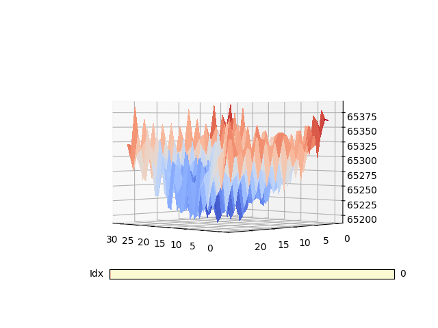

# Designing filter functions for the class
The class ThermalEventCamera, defined [here](Scripts/src/teventcamera.h), supports a custom thresholding function used for comparing the pixels and generating the event data. By default, instances of EventData are created and added to the queue when the pixel values are different. The GIF below shows the signs matrix using this default function.

The grouping of red cells seen is the author's hand being waved passed the sensor. Unfortunately, reacting to every change ruins the boundary of the hand making it difficult to differentiate from the noise. In order to design a better filter function, the statistics of the noise floor needs to be investigated to understand how activity is perceived.

The plots and statistics were generated using [this](Scripts/src/tevent_stat_processing.py) script.

The data used was recorded using the [tevent_hdf5](Scripts/examples/tevent_hdf5.cpp) and [tevent_hdf5_interp](Scripts/examples/tevent_hdf5_interp.cpp)

## Basic Format
### Noise
Below is a plot of one of the frames from [tevent_stats.hdf5](tevent_stats.hdf5)

Two things stand out immediately. First is majority of the pixels being above a value of 60,000. That dataset is just noise with no intended activity so it's unexpected for it to be towards the upper end of the data type (uint16_t). Secondly, is the data artifact for row 24 where the values drastically plummet, reaching zero in some of the frames. The cause of this data artifact is unknown.

If the data is cropped to ignore the row with the data artifact, the noise can be more easily inspected.

  
   

The noise is concave towards the centre of the image with values being between 65,107 and 65504.

### Hand Activity
The [tevent_stats_hand.hdf5](tevent_stats_hand.hdf5) is a dataset whereby the author waved their hand in front of the camera to simulate activity. Below are plots showing how the activity is perceived. The row containing the sheer drop data artifact has been cropped out for the plot.

  
  
  

The plots on the left and right clearly show that the hand activity stands above the noise floor. The middle plot shows a new unusual data artifact. The data in one region drops sharply towards a value of around 10000. The auto-scaling of the plot disguises the normal noise activity due to the vast difference between the sudden drop and the noise activity.

### Threshold

In both datasets, all activity occurs above a value of 65000 meaning that all data less than that can be discarded. To distinguish activity from the noise floor, an additional threshold is required. This is likely to depend on the temperature of the object in front of it, but as a moving hand would generate relatively weak activity when compared to the sensor's temperaure range it might act as a good starting point.

In order to subtract values from the data it has to be cast to the int32 data type which will now allow signed subtractions. If we plot the difference data as a surface we get the following.

  
  
  

The hand activity occurs above the relative value of 350 (absolute 65,350). If the data that is less than 350 to 0, it can be seen to effectively filter the mojority of the noise and leave the hand activity relatively intact. 

  
  
  

The left and middle plots show filtered data containing hand activity. The majority of the noise has been filtered separating the activity boundary from the noise. Some of the noise still remains towards the edges of the image but remain largely sporadic. This could be identified and removed using some sort of clustering algorithm that would estimate the size of these clusters.

As this is a rather harsh threshold, the boundary around the hand activity has likely been eroded a bit. A smarter filter could be formed if some unique features about the source of the activity is known such as size, shape, spatial decomposition etc.
