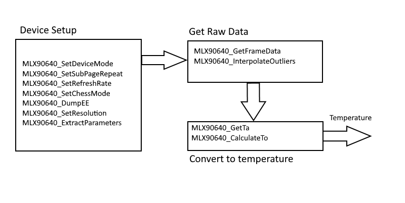
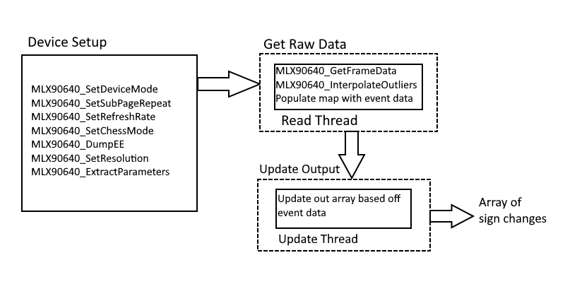

# ThermalEventCamera

**NOTE: This is an early version of the software and is likely to change in the future**

Event cameras are an emerging technology similar to picture cameras which rather than reading a frame of data at a fixed rate, pixel-wise changes are read asynchronously with the time, location and sign of the change.

This repo is an attempt at converting a MLX90640 thermal camera into an event camera, asynchronously reading the data over I2C bus and updating an array describing the changes. This won't be true asynchronous as there is a max refresh rate on the I2C bus so the focus will be setting up the process of responding to changes only.

## Requirements
 - [mlx90640 library](https://github.com/pimoroni/mlx90640-library)

## Survey Paper
 - Gallego, G., Delbruck, T., Orchard, G., Bartolozzi, C., Taba, B., Censi, A., Leutenegger, S., Davison, A., Conradt, J., Daniilidis, K., Scaramuzza, D.,
[Event-based Vision: A Survey](http://rpg.ifi.uzh.ch/docs/EventVisionSurvey.pdf),
IEEE Trans. Pattern Anal. Machine Intell. (TPAMI), 2020

## Structure
 - [bin](Scripts/bin) : All compiled scripts/ binaries and executables
 - [src](Scripts/src) : All source scripts
 - [build](Scripts/build) : All building scripts
 - [examples](Scripts/examples) : Scripts showing how to use the code in src

## Features
 - Wraps the functionality of the mlx90640 in a class
 - Threaded interface for reading and updating
 - Custom EventData structure containing timestamp, idx and sign of change.
 - Built in C++ 17
 - Allows user to define a custom function for comparing pixels from current and previous frame.

## Build Instructions
There is a [Makefile](Makefile) for this repository.

To make everything (currently just builds the examples)
```
make all
```

To make the examples
```
make examples
```

To delete built binaries and .o files
```
make clean
```

**NOTE: To build tevent_example, run [build_teventexample](build_teventexample.sh). The compilation instructions aren't currently in the Makefile**

## Scripts
### Source
 - [teventcamera.h](Scripts/src/teventcamera.h), [teventcamera.cpp](Scripts.teventcamera.cpp) : Defined ThermalEventCamera. Threaded class for reading i2C bus of the camera
 - [teventraw.h](Scripts/src/teventraw.h), [teventraw.cpp](Scripts/teventraw.cpp) : Threaded class to reads from camera in a raw fashion not using the i2c bus.
 - [thermalraw.py](Scripts/src/thermalraw.py) : Python version of teventraw.h for reading camera in a raw fashion.
 - [threadsafequeue.h](Scripts/src/threadsafequeue.h) : Thread-safe queue used in [teventcamera.h](Scripts/src/teventcamera.h) to hold pixel change events. Based off recipe from [here](https://codetrips.com/2020/07/26/modern-c-writing-a-thread-safe-queue/)
### Examples
 - [eventthermalcamera.cpp](Scripts/src/eventthermalcamera.cpp) : Naive attempt at reading and finding the element wise difference between the current frame and the previous one.
 - [tevent_example.cpp](Scripts/examples/tevent_example.cpp) : Shows how to use the ThermalEventCamera in an unthreaded and threaded manner
 - [tevent_compare.cpp](Scripts/examples/tevent_compare.cpp) : Shows how to set a custom comparison function in ThermalEventCamera and then apply it in a threaded manner.
 
## Theory
The image below shows the standard MLX90640 reading loop using the library functions. Each labelled block represents a collection of functions constituting a major step in the process. The arrows are the information that flows between each step.
 


In the class ThermalEventCamera, one thread continuously reads the I2C bus, processes the raw data and pushes updates of any pixel changes to a thread-safe queue and another reads the queue and updates a easier to use output matrix of just the signs. The class is defined [here](Scripts/src/threadsafequeue.h).



The queue is a collection of a custom structure called EventData defined in the thermalevent camera header [here](Scripts/src/teventcamera.h#L54). 

```c++
// structure for event data on each pixel
struct EventData{
	private:
		std::chrono::time_point<std::chrono::system_clock> time; // timestamp the change was logged
	public:
		signed short sign = 0; // sign of change, +1 for positive, -1 for negative
		int idx = 0; // array idx of change, currently 1D idx
		EventData(){}; // blank constructor, not time is not set
		// constructor passing idx and sign
		EventData(int ii,unsigned short sig){
			this->time  = std::chrono::system_clock::now(); // set timestamp
			this->sign = sig; // set sign change
			this->idx = ii;// set index
		}
		// method to retrieve the timestamp of edit
		std::chrono::time_point<std::chrono::system_clock> time() const {return this->time};
};
```
The member *sign* is the direction of the change and it set to either -1 or +1 for the negative or positive change respectively. The *idx* member is the 1D index of where this change happened in the read data array. It is 1D as the read array is non-rectangular at 834 bytes so cannot be references as a 2D array. The signs matrix updated by the class is accessible through the *out* member. 

The class contains three methods for displaying this signs matrix for debug purposes. The first method [printFrame](Scripts/src/teventcamera.cpp#L331) prints the most recent data as colours in the terminal. This is based off the [test](https://github.com/pimoroni/mlx90640-library/blob/master/examples/src/test.cpp) in the MLX90640 library. It prints the colors based on the estimated temperature values. The emissivity used in the conversion is by default set to 1 but can be changed through the public attribute *emissivity*. The second method [printSigns](Scripts/src/(Scripts/src/teventcamera.cpp#L210) prints the *out* matrix of sign values as colors in the terminal. The user can set which colors are used for +1 and -1 using the [setPosColor](Scripts/src/teventcamera.cpp#L288) and [setNegColor](Scripts/src/teventcamera.cpp#L244) methods respectively. Currently supported colors are the following for ease of use:

- red (default negative)
- yellow
- none
- green
- cyan (default positive)
- blue 
- magneta

The third method [printSignsRaw](Scripts/src/teventcamera.h#L230) prints the raw values of the signs matrix. The idea is the user can see the raw data without having to deal with colors in case there is an issue with the colors or something.

**NOTE: As the frame data and signs matrix are non-rectangular, the print methods iterate over the respective arrays as a 26 x 32 matrix (832 entries) so it can be printed as an "image" in the console**

## Results
### Console printing

The *ThermalEventCamera* class has a built in method for printing data to the console as colors (see above for details). The footage below was generated by running calls to read and then update in a while loop and is the output signs matrix. Blue represents a negative change and red a positive change. The author's hand is waved in front of the camera to facilitate a realistic change and be seen as a dense group of pixels appearing in the centre of the screen. Due to the noise of the sensor, it is difficult to discern the shape from the background nouse.


## Examples
### Basic example
The script example below shows a basic example of how to use the *ThermalEventCamera* class by it's threaded interface. The results are printed to the console as shown in the Console Printing section. An example demonstrating how to use it in an unthreaded manner and threaded manner with a time limit can be found [here](Scripts/examples/tevent_example.cpp)

```c++
#include "teventcamera.h"

int main(){
	ThermalEventCamera cam(32); // create camera
	int tlim = 60; // time limit in seconds
	// get start time
	auto start = std::chrono::system_clock::now();
	// start threaded update
	cam.start();
	// while loop condition set to exit on thread error
	while(cam.isUpdateAlive(0))
	{	// print frame as colors
		cam.printSigns();
		// get elapsed time
		auto elapsed = std::chrono::duration_cast<std::chrono::seconds>(std::chrono::system_clock::now() - start);
		// if the elapsed time exceeds the limit, break from loop
		if(elapsed.count()>tlim){
			std::cout << "stopping due to time limit" << std::endl;
			cam.stop();
			return 0;
		}
	}
}
```

### Custom Comparison Function
One of the main features of the class is the ability for users to specify a custom comparison funciton. By default the class performs the following log comparision between the pixels. This is from the survey paper and is the default so the class can be used "out of the box". 

```c++
// compare pixel c from current frame against pixel p from previous frame
65535*log(c+1)!=65535*log(p+1)
```

The user defined function has to accept two *uint16_t* variables, the current and previous pixel respectively, and return a boolean. The returned value indicates that the pixels are sufficiently different. If true, then an EventData structure is generated and added to the queue. As the MLX90640 sensor is particularly noisy, this support provides a way for the user to filter out the noise using a method of their choise.

This exmaple below shows how to set a custom function. A complete example can be found [here](Scripts/examples/tevent_compare.cpp)

```c++
#include "teventcamera.h"

// example of custom comparison function
// compares the current pixel (c) and previous pixel (p)
// if statements are because the pixels are unsigned variables
bool thresh(uint16_t c, uint16_t p)
{
	if(c>p)
	{
		return (c-p)>10;
	}
	else if(c<p)
	{
		return (p-c)>10;
	}
	else
	{
		return false;
	}
}

int main()
{
	ThermalEventCamera cam(32); // create camera
	int tlim = 60; // time limit in seconds
	// update comparison function
	cam.setCompare(thresh);
	// check comparison flag
	std::cout << "comparison function set: " << cam.getCompareFlag() << std::endl;
	std::cin.get(); // wait for user to press enter so they can see the print statement
	// get start time
	auto start = std::chrono::system_clock::now();
	// start threaded update
	cam.start();
	// loop until time limit or thread error
	while(cam.isUpdateAlive(0))
	{	// print frame as colors
		cam.printSigns();
		// get elapsed time
		auto elapsed = std::chrono::duration_cast<std::chrono::seconds>(std::chrono::system_clock::now() - start);
		// if the elapsed time exceeds the limit, break from loop
		if(elapsed.count()>tlim){
			std::cout << "stopping due to time limit" << std::endl;
			cam.stop();
			return 0;
		}
	}
}
```
